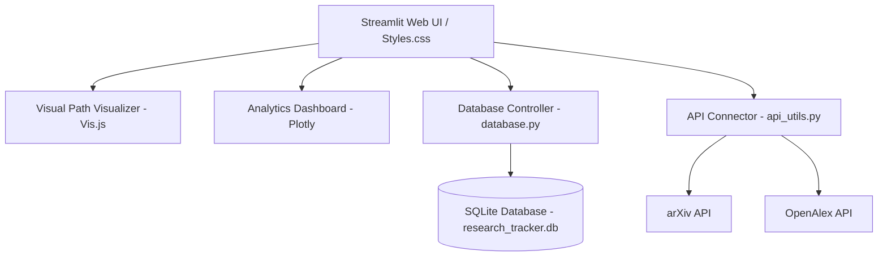

# Research Decision Tracker: A Local-First Academic Literature Flight Recorder

## 📋 Kaggle Project Overview
Modern research is increasingly accelerated by AI tools, discovery engines, and academic databases. While this drastically reduces the time required to find relevant papers, it introduces a new bottleneck: **Context Collapse**. Researchers frequently find themselves with folders full of downloaded PDFs without a clear history of how they found them, why certain resources were preferred, and why others were set aside.

The **Research Decision Tracker (RDT)** is a local-first desktop-grade application designed as a "flight recorder" for the academic literature review process. Unlike tools that recommend what to read next, the RDT documents the *actual path* of research. It structures queries, records resources retrieved, logs decision justifications (Selected, Rejected, Deferred), and renders a dynamic, interactive Directed Acyclic Graph (DAG) visualizing how each literature item is linked back to the original search query or research question.

This repository serves as a model case study in **Agentic Engineering** and **AI-Assisted Software Development**, showcasing how a human developer and an autonomous AI agent can pair-program to build, migrate, and refine a full-stack python application with high visual fidelity and robust software patterns.

---

## 🛠️ Software Architecture
The application is built on a clean, decoupled local-first stack designed to run locally with zero cloud dependencies or complex setup:

### 1. Data Layer (`database.py`)
- **SQLite Database**: A self-contained, relational SQLite schema enforcing integrity constraint checks (`PRAGMA foreign_keys = ON;`).
- **Entity Model**:
  - `projects`: Tracks active research scopes.
  - `queries`: Stores search terms, query engines (arXiv, OpenAlex, Google Scholar), and notes.
  - `resources`: Keeps track of paper metadata (titles, authors, journal, year, DOI, abstract, URL) and links back to the originating query (`source_query_id`).
  - `decisions`: Contains evaluation states (`Selected`, `Rejected`, `Deferred`) mapped to resources alongside detailed, mandatory justifications and notes.
  - `timeline_events`: An event-sourcing style table documenting audit trails of every database action (project creation, queries, resource logs, scope changes).

### 2. Service Layer (`api_utils.py`)
- **OpenAlex Integration**: Connects to the open academic catalog, resolving metadata and reconstructing abstracts from the inverted index payloads standard in OpenAlex API responses.
- **arXiv Feed Parser**: Issues REST queries to the arXiv API and parses atom-based XML feeds into clean Python dicts.
- **DOI Resolver**: Resolves academic digital object identifiers via OpenAlex API to auto-fill metadata.

### 3. Presentation Layer (`app.py` & `styles.css`)
- **Streamlit Framework**: Serves as the web framework container.
- **Vis.js Integration**: To circumvent Streamlit's static UI limitations, an interactive graph layout engine is embedded via Streamlit HTML components. This renders a Directed Acyclic Graph (DAG) using `vis-network` (Vis.js) on a custom dark-mode canvas.
- **Custom CSS Engine**: Implements a custom dark-themed UI system with glassmorphic cards, subtle box-shadow glows, responsive layouts, custom timeline nodes, and CSS transitions.
- **Plotly Analytics**: Generates project metrics (selection rates, query ratios, progress over time) through interactive charts.

---

## 🧠 Core Engineering Principles

### 🤖 Agentic Engineering & AI-Assisted Development
The Research Decision Tracker was engineered in partnership with **Antigravity**, an autonomous agentic AI assistant. Rather than utilizing basic autocomplete or simple prompt-to-code scripts, this project followed a mature software development lifecycle:
1. **Goal Alignment**: The human developer defined high-level feature requirements and design heuristics.
2. **Autonomous Planning**: The AI agent analyzed the codebase, mapped dependencies, researched APIs, and generated structured `implementation_plan.md` artifacts.
3. **Execution & Code Writing**: The AI agent modified python files, adjusted layouts, handled database migrations, and implemented custom styling rules.
4. **Automated Verification**: The agent wrote and executed automated tests to guarantee database operations worked flawlessly before finalizing modifications.

### 🔍 Reasoning-Based Coding
Building the application required solving complex, multi-variable logic problems that simple code generators struggle to resolve:
- **Abstract Reconstruction**: OpenAlex represents abstracts as an inverted index (word positions) for copyright reasons. The service layer implements a sorting-based reconstruction algorithm to build human-readable abstracts.
- **Backwards-Compatible Schema Migrations**: When adding fields for CSV imports (e.g., `publication_date`, `related_topics`, `summary`), the database initializer was refactored with structural introspection. It queries `PRAGMA table_info(resources)` to dynamically add missing columns, ensuring existing databases did not corrupt or break.
- **Fault-Tolerant CSV Ingestion**: Implemented a column-mapping algorithm that handles case-insensitivity, spelling variations, and missing fields to ensure users can import metadata from arbitrary sources safely.

### 🔄 Conversational Iteration & Human-in-the-Loop Design
The development history is defined by a tight collaborative loop:
- **Design Review**: The human developer inspected implementation plans before any changes were made, ensuring no code churn occurred.
- **UI Aesthetic Calibration**: The developer requested a premium, state-of-the-art visual appearance. The agent translated this into an dark-theme palette using CSS overrides, gradients, custom-colored SVG icons, and micro-animations.
- **Verification Loop**: If any runtime errors or test mismatches occurred, the agent reasoned through the logs, corrected the SQL transactions, and re-ran the test suite until green.

---

## 🧪 Reproducibility & Automated Testing
To guarantee that the project can be run, audited, and verified by any researcher or developer, it maintains strict reproducibility guarantees:
- **Local SQLite DB**: No databases to configure or credentials to manage. The DB initializes automatically on launch.
- **Self-Contained Test Suite (`test_db.py`)**:
  - Automatically initializes a test database.
  - Verifies CRUD operations for projects, queries, resources, and decisions.
  - Audits timeline event logging and analytics aggregation.
  - Performs complete database cleanup post-verification.
- **Simple Dependency Model**: Standard Python requirements with no heavy external binaries or Docker requirements.

---

## 💡 Lessons Learned
1. **Streamlit Customizability Limits**: Streamlit is highly productive but visually restrictive. Overcoming this to create a premium, production-grade interface requires deep integration of custom CSS and HTML iframe wrappers for JS libraries like `vis-network`.
2. **Local-First Resiliency**: Relying on SQLite allows the software to remain entirely private, fast, and serverless, making it perfect for researchers handling sensitive or embargoed studies.
3. **Agentic Productivity Gains**: Pair-programming with an autonomous agent that handles planning, refactoring, and regression testing frees the developer to focus on UX design, feature prioritization, and system architecture.
4. **Data Sync Challenges**: Standardizing metadata formats between distinct APIs (arXiv uses XML Atom feeds; OpenAlex uses JSON) requires robust mapping wrappers to keep the internal database schema normalized.
